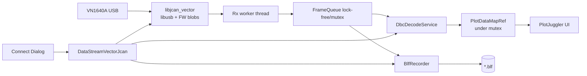
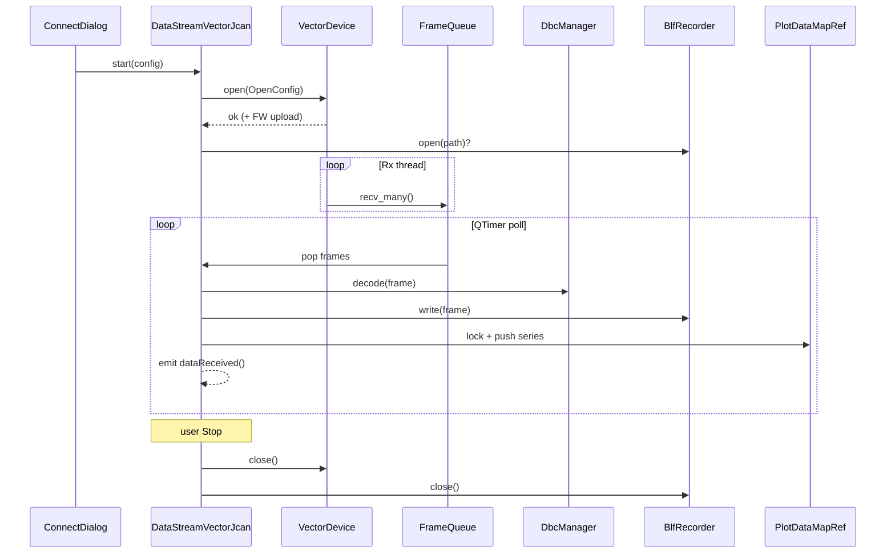

# 方案 A：jcan Vector → PlotJuggler 实时 DBC + BLF 录制

## 1. 目标 / 非目标

### 目标（MVP）
1. Linux 下用 **VN1640A**（libusb / jcan 协议栈）实时接入 PlotJuggler。
2. 加载 **DBC**（可多文件、按 channel 映射），实时解信号并画曲线。
3. 可选 **实时录制 BLF**（CAN / CAN FD），录完可用现有 `DataLoadBLF` 回放。
4. 命名与配置风格对齐现有 `DataLoadBLF`（见 `docs/superpowers/specs/2026-03-28-canfd-blf-dataloader-design.md`）。
5. **许可证策略（已定）**：插件内直链 `vector_blf` 写 BLF，接受 GPL-3.0-or-later。

### 非目标（首版不做）
- 官方 XL API / CANoe / CANape 兼容。
- 老款 VN1640（非 A）保证可用（仅预留 PID 扩展点）。
- LIN / SENT / IO / ISO-TP / J1939 重组。
- SocketCAN 内核驱动、Wine、Windows `vxlapi`。
- jcan imgui GUI 内嵌进 PlotJuggler。

---

## 2. 现状对齐

| 组件 | 现状 | 本方案用法 |
|------|------|------------|
| jcan `vector_xl`（`hardware_vector.hpp`） | `open/close/send/recv/recv_many`，固件上传，CAN FD | 抽出为无头库核心 |
| jcan `can_frame` / `types.hpp` | id/ext/rtr/fd/brs/dlc/data[64]/timestamp | 跨模块统一帧模型（或薄适配） |
| jcan `dbc_engine` | `dbcppp`，`decode(can_frame)` | 可复用思路；PJ 侧优先复用你 fork 的 `DbcManager` |
| jcan `frame_logger` | 仅 CSV/ASC | **不用**；BLF 另做 Writer |
| PlotJuggler `PJ::DataStreamer` | `start/shutdown/isRunning`，`mutex()`+`dataMap()`，`dataReceived()` | 插件入口 |
| 你的 `DataLoadBLF` | BLF 读 + DBC + raw/dbc 命名 | 共享解码与命名约定；只读不写 |

---

## 3. 总体架构



**进程模型**：全部在 PlotJuggler 进程内。  
**线程模型**：
- USB 收包线程：只做 `recv_many` → 入队（尽量不做 DBC/UI）。
- 插件主逻辑（Qt 定时器或同线程 drain）：出队 → DBC → `lock(mutex())` 写 `dataMap()` → `emit dataReceived()`。
- BLF 写：可与 decode 同线程同步写，或独立写线程 + 同队列副本（高负载时再拆）。

---

## 4. 仓库 / 目录拆分

建议落在 **PlotJuggler_CAN_BLF** 内（与 DataLoadBLF 同仓），jcan 以 submodule 或 vendored 抽取：

```
PlotJuggler_CAN_BLF/
  3rdparty/
    jcan_vector/                 # 从 jcan 抽出的最小集（或 git submodule + overlay）
      include/jcan_vector/
        types.hpp                # can_frame, result, error_code
        vector_device.hpp         # 公开 API
        discovery.hpp            # VID/PID 枚举
      src/
        hardware_vector.cpp      # 自 hardware_vector.hpp 拆实现
        firmware_blobs.S / .cpp  # vn1640a_*.bin 嵌入
      firmware/
        vn1640a_main_fw.bin
        vn1640a_fpga.bin
        vn1640a_bc2.bin
      CMakeLists.txt
  plotjuggler_plugins/
    DataStreamVectorJcan/        # 新插件
      datastream_vector_jcan.h/.cpp
      connect_dialog.h/.cpp/.ui
      frame_queue.h
      blf_recorder.h/.cpp
      CMakeLists.txt
    DataLoadBLF/                 # 已有：只读
    common_can/                  # 建议抽出共享层（若尚未独立）
      normalized_frame.hpp       # 与 DataLoadBLF 同一 normalized model
      dbc_manager.*              # 多 DBC + channel 映射
      series_naming.*            # raw/ / dbc/ 路径规则
      signal_emitter.*           # 写入 PlotDataMapRef
```

**原则**：GUI / Qt 只出现在 `DataStreamVectorJcan`；USB 与固件零 Qt。

---

## 5. 模块职责与接口

### M1 — `libjcan_vector`（无 GUI）

公开表面（建议，基于现有 `adapter_*` / `vector_xl`）：

```cpp
namespace jcan_vector {

struct CanFrame { /* 对齐 jcan::can_frame */ };

struct OpenConfig {
  uint8_t channel = 0;          // 0..3
  uint32_t bitrate_arb = 500000;
  uint32_t bitrate_data = 2000000; // FD
  bool listen_only = false;
  // port 建议直接用 discovery 的 "usb_path:ch"；bitrate 映射进 open() 内部 timing
  std::string port;  // e.g. "1-2:0"
};

class VectorDevice {
public:
  static std::vector<DeviceInfo> list();   // lsusb 级枚举
  result<> open(const OpenConfig&);
  result<> close();
  bool is_open() const;

  result<> send(const CanFrame&);
  result<std::vector<CanFrame>> recv_many(unsigned timeout_ms);

  // 诊断
  std::string last_error() const;
};

}  // namespace jcan_vector
```

**从 jcan 带过来**：`hardware_vector.hpp` 协议、端点、`CMD_*`、固件下载。  
**不要带过来**：imgui、`gui_main`、`widgets/*`、`logger.hpp`（CSV/ASC）、Kvaser/SLCAN。

**依赖**：`libusb-1.0`；C++20/23（`std::expected`）；嵌入固件 blob。

**许可注意**：固件二进制来自逆向包；文档注明实验用途，对外分发需自审。

---

### M2 — `common_can`（与 DataLoadBLF 共享）

对齐已有设计中的 **Normalized Frame**：

- `timestamp_sec`, `channel`, `can_id`, `is_extended_id`
- `is_fd`, `is_brs`, `is_esi`, `dlc`, `data_bytes[0..64]`

**优先复用 DataLoadBLF 已有** `DbcManager` / `DbcpppDecoder` / `DecodedSeriesName`（见 §12.1），不要再引入 jcan `dbc_engine` 平行实现。  
**`SeriesNaming` / `SignalEmitter`**：

- Raw：`raw/can<ch>/0x<ID>/dlc|is_fd|is_brs|data_XX`
- Decoded：`dbc/can<ch>/<message_name>/<signal_name>`

实时与离线共用同一套命名 → 布局可复用。

---

### M3 — `DataStreamVectorJcan`（`PJ::DataStreamer`）

```cpp
class DataStreamVectorJcan : public PJ::DataStreamer {
  Q_OBJECT
  Q_PLUGIN_METADATA(IID "facontidavide.PlotJuggler3.DataStreamer")
  Q_INTERFACES(PJ::DataStreamer)
public:
  bool start(QStringList* pre_selected) override;
  void shutdown() override;
  bool isRunning() const override;
  const char* name() const override { return "Vector VN1640A (jcan)"; }
};
```

**`start()` 流程**：
1. 弹出 `ConnectDialog`（设备、通道、仲裁/数据波特率、DBC 列表与 channel 映射、是否录 BLF、路径、emit_raw / emit_decoded）。
2. `VectorDevice::open(cfg)`；失败则提示并 `return false`。
3. 若录制：`BlfRecorder::open(path)`。
4. 启 Rx 线程；`_running = true`。
5. 启 `QTimer`（如 16–33ms）`onPoll()`：drain 队列 → decode → `lock(mutex())` 推点 → `emit dataReceived()`。

**`shutdown()`**：停 timer/线程 → `deactivate`/`close` 设备 → `BlfRecorder::close()`（写完 footer）→ `_running = false`。自发停止时 `emit closed()`。

**XML 持久化**（layout）：DBC 路径、channel 映射、bitrate、通道、录制默认路径、两个 emit 开关 —— 与 DataLoadBLF 字段对齐，便于一套配置。

---

### M4 — `BlfRecorder`（写）

你侧已有 **读**（`vector_blf`）。写优先：

1. 库能力：同仓 `vector_blf` **可以写**（`File::write` + `CanMessage`/`CanFdMessage`/`CanFdMessage64`）。  
2. **已定**：插件内直链 `vector_blf` 写 BLF，接受 GPL-3（见 §12.4）。  
3. 实现：`BlfRecorder` 封装 `Vector::BLF::File`，经典帧用 `CanMessage`/`CanMessage2`，FD 用 `CanFdMessage` 或 `CanFdMessage64`（与 DataLoadBLF 读侧对象对齐）。

接口草图：

```cpp
class BlfRecorder {
public:
  bool open(const std::filesystem::path& path);
  void write(const NormalizedFrame& f);  // 线程约定：仅 poll 线程调用
  void close();  // flush + finalize header/stats
  bool is_open() const;
};
```

时间戳：优先设备/主机单调时钟换算成 BLF object timestamp（ns）；与曲线 `timestamp_sec` 同源，避免回放错位。

首版对象类型：经典 CAN + CAN FD；错误帧 / 总线统计可后续加。

---

### M5 — `ConnectDialog`（仅 UI）

字段：
1. Device list（`VectorDevice::list()` + Refresh）
2. Channel（0–3，首版单通道 MVP 即可）
3. Bitrate arb / data
4. DBC 多选 + channel 映射表（复用 DataLoadBLF 控件更好）
5. Toggles：`emit_raw_frames`, `emit_decoded_signals`
6. Record BLF：checkbox + 路径 + 浏览
7. Advanced：listen-only、debug USB log

OK 前校验：设备在线；若只开 decoded 则至少一个 DBC 加载成功。

---

## 6. 数据流（时序）



---

## 7. 构建与依赖

| 依赖 | 用途 | 备注 |
|------|------|------|
| Qt5（与本 fork 一致，C++17） | 插件 UI | 非 Qt6 |
| libusb-1.0 | VN1640A | pkg-config |
| dbcppp | DBC | 已与 DataLoadBLF 共用 find_or_download |
| vector_blf | BLF 读写 | 读已有；写已定直链（GPL-3） |
| jcan firmware blobs | 每次 open 下载 | 随库打包 |

CMake：
- `3rdparty/jcan_vector` → `STATIC`/`OBJECT` lib `jcan_vector`
- `DataStreamVectorJcan` `MODULE` 链 `jcan_vector` + `common_can` + Qt + PJ sdk
- 选项：`PJ_BUILD_DATASTREAM_VECTOR_JCAN=ON`（Linux only）

---

## 8. 实现分期

### P0 — 骨架（约 3–5 天）
- 抽出 `libjcan_vector`，独立小 demo：`list/open/recv` 打印帧。
- `DataStreamVectorJcan` 空插件能出现在 Streaming 列表，`start` 弹对话框。

### P1 — 实时曲线（约 1 周）
- Rx 线程 + queue + `SignalEmitter`。
- DBC 映射；raw + decoded 命名对齐 DataLoadBLF。
- 单通道、固定 bitrate 跑通。

### P2 — BLF 录制（约 3–7 天）
- `BlfRecorder` CAN/CAN FD。
- Stop 时文件可被现有 `DataLoadBLF` 打开，信号路径一致。

### P3 — 打磨
- 多通道、掉线重连、通知铃铛、布局 XML。
- 可选：VN1640 非 A PID 探测（失败则明确提示）。
- 性能：高负载时降 raw 字节序列或仅 decoded。

---

## 9. 风险与对策

| 风险 | 对策 |
|------|------|
| 固件/协议随 Vector 驱动版本变化 | 锁 jcan 已验证 blob；版本矩阵记入 README |
| `vector_blf` 写 API 不熟 | P2 前先写 10 帧最小 BLF 用 DataLoadBLF 回读验收 |
| libusb 权限 | udev 规则文档；失败映射 `permission_denied` |
| 时间戳抖动 | 统一用 host steady → 相对 t0；BLF 与曲线同源 |
| DBC 与 jcan `message_dlc` 经典 8 字节坑 | 实时路径用 `NormalizedFrame` + FD DLC 映射，勿直接复用 jcan 里限 8 的辅助函数 |
| 法律/分发 | README 标明实验/逆向；商用需法务自评；接受 GPL 直链 vector_blf |

---

## 10. 验收标准

1. Streaming 中可选 **Vector VN1640A (jcan)**，能枚举并打开设备。  
2. 加载 DBC 后，实时出现 `dbc/can.../signal` 曲线，可拖入图。  
3. 可选录制 BLF；停止后用 **同一 fork 的 DataLoadBLF** 打开，关键信号可对齐。  
4. 无 DBC 时仍可看 raw 系列（若开启）。  
5. Stop / 拔线不崩；`shutdown` 释放 USB。  
6. 文档写明：非官方驱动、仅 VN1640A MVP、无 CANoe。

---

## 11. 建议的下一步工程任务（可直接开 PR）

1. `3rdparty/jcan_vector`：从 jcan 摘 `types` + `hardware_vector` + firmware，加 `vector_device` 门面与 CMake。  
2. `common_can`：从 DataLoadBLF 抽出 `NormalizedFrame` / `DbcManager` / naming（若已内嵌则先做头文件边界）。  
3. `DataStreamVectorJcan` P0 插件壳 + ConnectDialog。  
4. 写 `docs/superpowers/specs/2026-09-05-datastream-vector-jcan-design.md`（本文）入库。

---

## 12. 修订记录（调研对齐，2026-09-05）

对照仓库实装后的修正，实现时以本节为准：

### 12.1 与 DataLoadBLF 实装对齐的路径/类型
- 插件目录：`plotjuggler_plugins/DataLoadBLF/`
- 已有类型/组件（应直接复用，勿平行再造）：
  - `NormalizedCanFrame`（在 `blf_decoder.h`）
  - `DbcManager`、`DbcpppDecoder`、`IDbcDecoder`
  - `RawByteSeriesName` / `DecodedSeriesName`
  - `BlfPluginConfig`（`blf_config.h`）— 实时侧 XML 字段尽量同构
- 读路径参考：`BlfReader::ReadFrames` → `BlfDecoderPipeline::ProcessFrame` → `ISeriesWriter::WriteSample`

### 12.2 C++ / Qt 约束
- PlotJuggler_CAN_BLF：**C++17 + Qt5 only**
- jcan：**C++23**（`std::expected`、`std::format`）
- **做法**：`jcan_vector` 实现可用 C++23 TU；对外导出 **C++17 安全门面**（错误码枚举 + 出参，或 opaque handle + C API）。禁止把 `std::expected` 泄漏进插件头文件。

### 12.3 jcan 真实表面（无虚基类）
- `hardware.hpp`：`std::variant` + `adapter_open/close/send/recv/recv_many`
- Linux Vector：`vector_xl` in `hardware_vector.hpp`
- `open(port, bitrate, baud)` 内部完成 timing + transceiver + `activate`；**无公开 `set_timing`/`activate`**
- Port 形式：`"{usb_path}:{channel}"`（见 `discovery.cpp`）
- PID：VN1640A `0x1073`（VID `0x1248`）；另有 VN1630A/VN1610
- 固件嵌入：`vn1640a_main_fw.bin` + `vn1640a_fpga.bin`（`bc2.bin` 未嵌入）

### 12.4 BLF 写入与许可证（已拍板）
- `vector_blf`（Technica / Toby Lorenz）：**支持 write**（`File::open(out)` + `write(ObjectHeaderBase*)` + `CanMessage` / `CanFdMessage` / `CanFdMessage64`），许可证 **GPL-3.0-or-later**
- **已定策略（2026-09-05）**：**接受 GPL，在 `DataStreamVectorJcan` / `BlfRecorder` 内直链 `vector_blf` 写 BLF**（与现有 DataLoadBLF 读路径同一依赖）
- 分发注意：对外发插件/AppImage 时按 GPL-3 义务提供对应源码；README/About 中标明 `vector_blf` 与 GPL
- 备选（未采用）：进程外置录制、自研 MIT Writer、python-can 子进程


### 12.5 插件注册方式
```cpp
Q_PLUGIN_METADATA(IID "facontidavide.PlotJuggler3.DataStreamer")
Q_INTERFACES(PJ::DataStreamer)
```
参考：`plotjuggler_plugins/DataStreamSample`、`DataStreamUDP`。  
不要用 `pj-official-plugins` 的 `PJ_DATA_SOURCE_PLUGIN`（另一套 SDK）。

### 12.6 推点范式（必须）
```cpp
{
  std::lock_guard<std::mutex> lock(mutex());
  auto& s = dataMap().getOrCreateNumeric(name);
  s.pushBack({t, v});
}
emit dataReceived();
```
